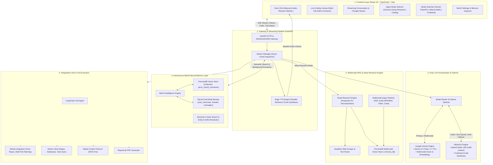

# Aisia Jarvis RAG: System Architecture & Engineering Blueprint

This document details the complete end-to-end architecture of **Aisia Jarvis RAG**, an autonomous multi-modal agent platform featuring real-time conversational voice streaming, persistent Mem0 neural memory, dual LLM orchestration (Google Gemini & Mistral / Codestral), Perplexity-grade Deep Research, and Live Coding Canvas.

---

## 1. High-Level Architectural Diagram

---

## 2. Core Subsystems & Components

### 2.1. Frontend Layer (`jarvis-frontend`)
* **Technology**: React 19, TypeScript, Vite.
* **Voice Orb (`VoiceOrb.tsx`)**: Concentric audio-reactive pulses with Gemini Cloud iridescent shader theme, radial glow, pure circle, and spectrum visualizers.
* **Live Coding Canvas (`CodingCanvas.tsx`)**: In-browser multi-file IDE with live DOM preview, JSZip export, and one-click GitHub push.
* **SSE Client Protocol**: Parses real-time Server-Sent Events (`token`, `audio`, `tool_step`, `follow_ups`, `done`).
* **Mem0 UI**: Live counter of remembered facts, search filter across semantic memories, manual fact addition, and UUID-based deletion.

### 2.2. API Gateway & Stream Manager (`stream_manager.py`)
* **FastAPI Server (`main.py`)**: High-throughput async ASGI web server.
* **Unified Event Streaming**: Coordinates interleaved token delivery, stage-direction stripping, and parallel sentence-by-sentence text-to-speech synthesis using Microsoft Edge TTS.
* **Model Routing**: Dynamically routes requests based on user selection or task type.

### 2.3. Dual LLM Orchestration & Failover
* **Google Gemini**:
  - `gemini-3.5-flash-lite`: Low-latency streaming, native multimodal image and document understanding.
  - `gemini-2.5-flash` / `gemini-3.7-flash`: Deep reasoning and agentic tool planning.
  - `models/gemini-embedding-001`: Vector embeddings for memory and RAG.
* **Mistral AI**:
  - `open-mistral-nemo`: 128k context window, 12B parameter model for conversational chat, fact extraction, and summarization without consuming Gemini quota.
  - `codestral-latest`: State-of-the-art coding model specialized in multi-file generation and refactoring.
* **Automated Failover**: If Gemini encounters rate limits (`429`) or demand spikes (`503 UNAVAILABLE`), the stream seamlessly fails over to Mistral NeMo.

### 2.4. Autonomous Mem0 Neural Memory Layer (`memory.py`)
* **Mem0 (`mem0ai`)**:
  - Continuous learning from conversation turns via background async threads.
  - Automatic entity, preference, and fact extraction without rigid regex formulas.
  - Semantic vector search powered by local ChromaDB (`./chroma_mem0`).
  - Dual-write mirror into SQLite (`jarvis.db`) for ACID compliance and transactional data persistence.
* **Dynamic System Prompt Injection**: Generates prompt context by semantically retrieving only the memories pertinent to the user's specific query.

### 2.5. Deep Research & Multimodal RAG
* **Deep Research (`deep_research.py`)**:
  - Sub-query decomposition breaking complex inquiries into multi-angle search targets.
  - DuckDuckGo search + parallel web page fetching and HTML sanitization.
  - Citation grounding with inline brackets (`[1]`, `[2]`).
  - Automated PDF report creation (`pdf_generator.py`) and Notion workspace brief synchronization.
* **Multimodal Ingestion (`multimodal_ingest.py` & `rag_engine.py`)**:
  - Automatic indexing of PDFs, audio transcriptions, video topics, and code files into `./chroma_db`.

### 2.6. Integrations & Tool Hub
* **GitHub Integration (`big_agent_tools.py`)**: Automatic repo creation, branch management, and multi-file commit pushes via GitHub REST API.
* **Notion Integration (`notion_tools.py`)**: Reading pages/databases, appending tasks, and syncing research outputs.
* **Model Context Protocol (MCP) (`mcp_manager.py`)**: Host telemetry, SQL query executor, and extensible JSON-RPC tool integrations.

---

## 3. Data Flow Life Cycle

1. **User Input**: Query entered via voice or text input in React 19 interface.
2. **Context Assembly**:
   - Relevant conversation history loaded for current `thread_id`.
   - Mem0 executes vector similarity search to retrieve relevant user facts and injects them into the system prompt.
3. **Execution Routing**:
   - If `agent_mode == 'deep_research'`, the deep research pipeline decomposes the query, scrapes web sources, and synthesizes citations.
   - If `agent_mode == 'coding'`, multi-file code artifacts are generated (prioritizing Codestral).
   - If tools are needed, the LangChain agent executes tools and emits Perplexity-style badge steps.
   - Otherwise, fast SSE token streaming begins immediately.
4. **Speech & Audio**: Edge TTS synthesizes audio concurrently sentence-by-sentence.
5. **Memory Consolidation**: Assistant reply is saved to SQLite history and passed to Mem0 in the background to automatically deduce and store newly learned facts.
